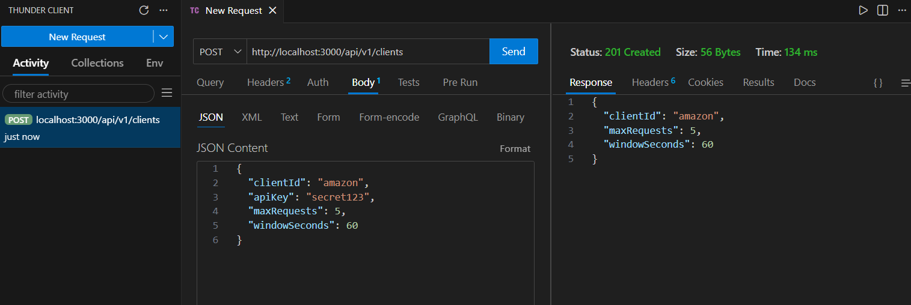
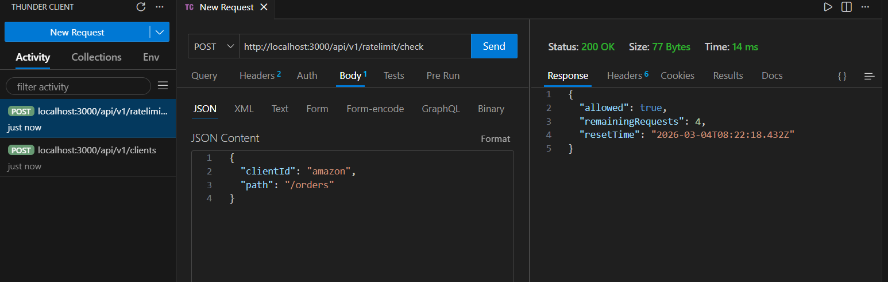
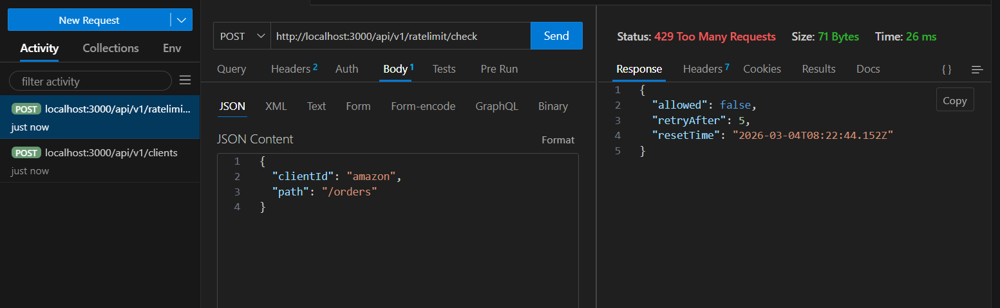
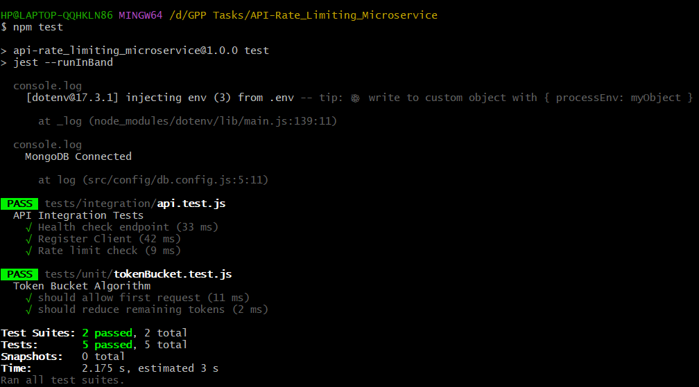
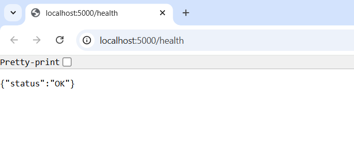

# API Rate Limiting Microservice

## Overview

This project implements a **distributed API rate-limiting microservice** using the **Token Bucket algorithm**.
It protects backend services from abuse by enforcing request limits per client and endpoint.

The system is designed as a **scalable microservice** that can run multiple instances while maintaining consistent rate-limiting state using Redis.

## Tech Stack

* **Node.js + Express** — REST API service
* **Redis** — distributed rate limit state
* **MongoDB** — API client registry
* **Docker & Docker Compose** — containerized deployment
* **Jest + Supertest** — unit & integration testing
* **GitHub Actions** — CI pipeline

## System Architecture

```
Client
   │
   ▼
API Gateway / Proxy
   │
   ▼
Rate Limiting Microservice
   │
   ├── Redis (Rate Limit State)
   └── MongoDB (Client Configuration)
   │
   ▼
Backend Services
```

The rate-limiter acts as a **gatekeeper** that determines whether a request should be allowed based on the configured limits.

## Features

* Token Bucket rate limiting algorithm
* Distributed rate-limiting state using Redis
* Client registration API
* Rate limit enforcement per client + endpoint
* Dockerized application
* Unit tests for algorithm logic
* Integration tests for API endpoints
* Automated CI pipeline using GitHub Actions


## Project Structure

```
my-ratelimit-service
│
├── src/
│   ├── controllers/
│   ├── services/
│   ├── models/
│   ├── routes/
│   ├── config/
│   └── app.js
│
├── tests/
│   ├── unit/
│   └── integration/
│
├── .github/workflows/
│   └── ci.yml
│
├── Dockerfile
├── docker-compose.yml
├── init-db.js
├── .env.example
├── package.json
└── README.md
```

## Rate Limiting Algorithm

This service uses the **Token Bucket algorithm**.

How it works:

1. Each client has a **bucket containing tokens**.
2. Every API request **consumes one token**.
3. Tokens **refill gradually over time**.
4. If no tokens remain, the request is **rejected with HTTP 429**.

Advantages:

* Allows **short bursts of traffic**
* Prevents sustained abuse
* Works well in **distributed systems with Redis**


## API Endpoints

### 1. Register Client

**POST**

```
/api/v1/clients
```

Request Body

```json
{
  "clientId": "amazon",
  "apiKey": "secret123",
  "maxRequests": 5,
  "windowSeconds": 60
}
```

Response

```
201 Created
```

Response Body

```json
{
  "clientId": "amazon",
  "maxRequests": 5,
  "windowSeconds": 60
}
```

Error

```
409 Conflict
```

Returned if the client already exists.


### 2. Check Rate Limit

**POST**

```
/api/v1/ratelimit/check
```

Request Body

```json
{
  "clientId": "amazon",
  "path": "/orders"
}
```

Allowed Response

```json
{
  "allowed": true,
  "remainingRequests": 4,
  "resetTime": "timestamp"
}
```

Exceeded Limit Response

```
HTTP 429 Too Many Requests
```

```json
{
  "allowed": false,
  "retryAfter": 25,
  "resetTime": "timestamp"
}
```

## Running the Project Locally

Clone the repository:

```
git clone <repo-url>
cd my-ratelimit-service
```

Start the application using Docker:

```
docker-compose up --build
```

Check service health:

```
http://localhost:3000/health
```

## Running Tests

Run all tests:

```bash
npm test
```

Test coverage includes:

* Unit tests for rate-limiting algorithm
* Integration tests for API endpoints

## Environment Variables

Example `.env.example`

```
PORT=3000

DATABASE_URL=mongodb://mongo:27017/ratelimitdb

REDIS_URL=redis://redis:6379

DEFAULT_RATE_LIMIT_MAX_REQUESTS=10
DEFAULT_RATE_LIMIT_WINDOW_SECONDS=60
```

## CI Pipeline

GitHub Actions automatically:

1. Installs dependencies
2. Starts MongoDB and Redis services
3. Runs unit tests
4. Runs integration tests

Pipeline configuration:

```
.github/workflows/ci.yml
```

## Screenshots

### Client Registration



### Allowed Request



### Rate Limit Exceeded



### Test Results



### Health Check

